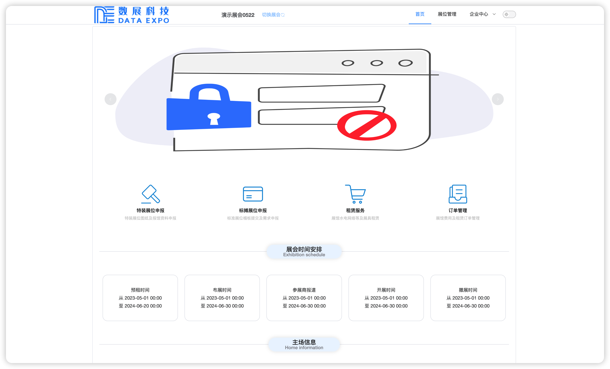

## 开始申报

::: warning 注意

在开始申报之前您应首先获得参展商的授权！

:::

本文将帮助您从零开始完成一个特装展位的申报，包括展位信息以及图纸资料的提交。

### 搭建信息申报

1. 进入系统后，首先选择您所属的展会项目；

   

2. 进入首页；

   

3. 点击`特装展位申报` 按钮；

   

4. 输入您的展位号后，点击下一步；

::: warning 注意

请确认您输入的是正确的展位号！

:::

如果您的展位号不存在，此时系统将提示您需要新增并自动跳转至新增展位页。

5. 新增展位，如您的展位不需要新增（未进入新增页），请移步至步骤 6；

   

   在此输入您的展位信息后，点击立即提交即可。

6. 进入申报须知页

   

   

​	每个页面需要仔细阅读 15 秒以上，完成之后，勾选已知悉点击下一步

7. 提交搭建信息

​	申报数据务必确保准确且真实，否则无法完成申报。

​	通常情况下，主场管理方会在此处设置审核，审核通过后，方可进行步骤 8 提交图纸

### 图纸资料申报

8. 在您的搭建信息审核通过后，进入展位管理

9. 在展位列表找到您需要提交图纸、资料的展位，点击`提交图纸信息`

10. 按要求上传您的图纸资料即可

完成以上操作后，等待图纸、资料审核通过后，方可开始付款、租赁。

## 常见问题

描述用户使用时可能遇到的问题及其解决方案。

### 搭建信息被驳回之后如何修改？

1. 进入展位管理，找到被驳回的展位，进行如下图所示的操作；

2. 在页面上方查看驳回理由

3. 根据驳回理由修改后，点击`立即提交` 

### 图纸被驳回，如何查看驳回理由并修改图纸？

当图纸被驳回时，需要根据主场管理方的意见进行修改，下面将描述如何查看主场管理方的审核意见。

1. 进入展位管理，找到对应的展位，点击`修改图纸信息` 

2. 进入修改页后，查看每一张图纸，对已驳回的图纸进行修改

3. 点击`替换` 上传修改后的图纸或资料

