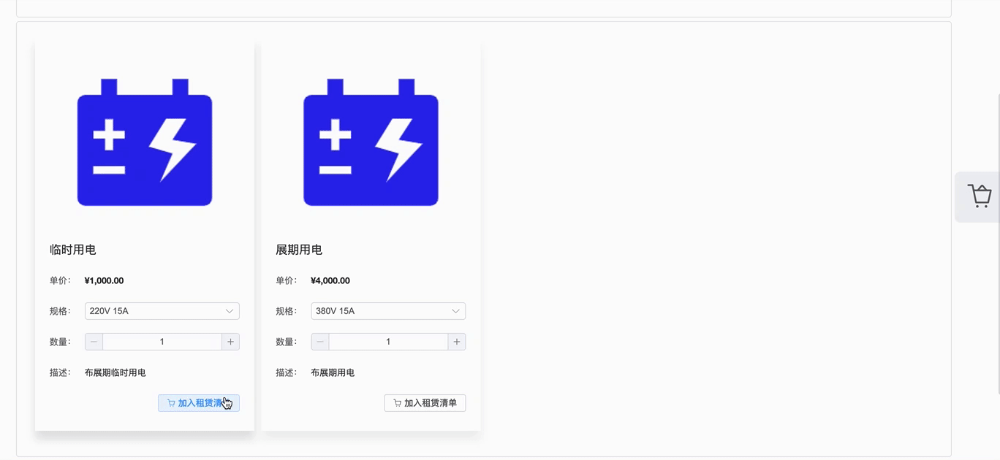

## 功能简介

系统针对不同展位，不同申报阶段，提供了两种订单类型：

- 租赁订单：只包含租赁品的订单，用户可以手动生成；
- 展馆费用订单：包含特装管理费、特装押金、审图费等固定费用的订单，系统在主场管理方指定阶段自动生成，用户无法手动生成；

特装展位除了会自动生成展馆费用订单外，在展馆费用订单付款成功后，也可以手动生成租赁订单。

## 操作流程

### 展馆费用订单

针对特装展位，系统会在`搭建信息`或`图纸资料`审核通过后生成展馆费用订单，具体在哪个阶段生成以主场管理单位通知为准。

1. 进入系统后，点击`订单管理` 。

2. 找到对应展位的订单，可以点击`查看订单` 查看订单详情。

::: warning 注意

特装展位必须进行租赁，才能提交到主场管理方！

:::

3. 点击`去租赁`进入租赁列表。

4. 选择规格。

5. 加入租赁清单

6. 结算订单

订单结算之后即进入待审核状态，主场管理方审核通过之后，方可进行付款。

### 租赁订单

针对标摊展位与固定费用订单已完成的特装展位，进行租赁将会生成对应的租赁的订单。

1. 在首页点击进入租赁服务。

2. 选择需要租赁的展位，点击`去租赁`。

3. 选择规格。

4. 选择规格。

5. 结算订单。

## 常见问题

针对用户在使用过程中可能遇到的问题进行答疑。

### 订单被驳回，如何处理？

当订单被驳回时，需要用户手动处理，按管理方的审核意见修改订单后再提交审核。

1. 在首页点击进入订单管理，找对被驳回的订单点击`修改订单`。

2. 根据驳回理由对订单进行修改。

3. 修改完成后，下翻到页面底部，点击`提交表单` 按钮进行提交。

