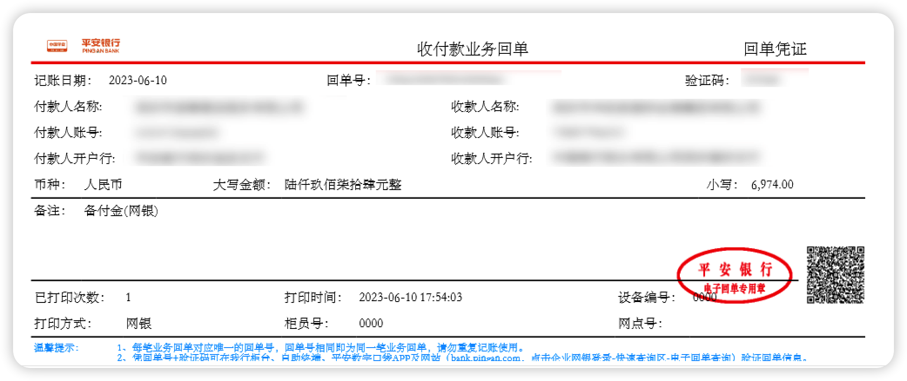
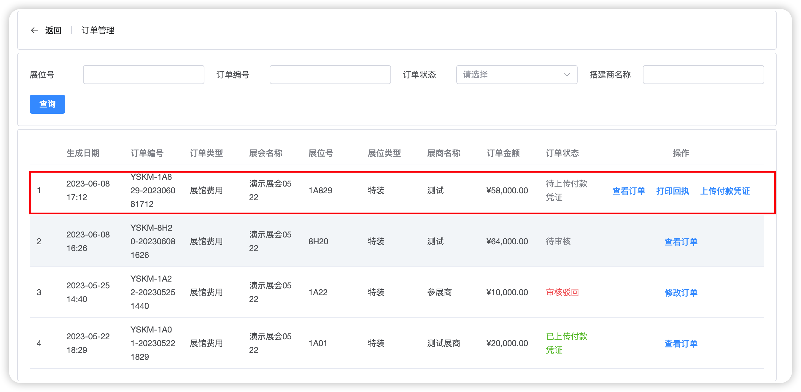
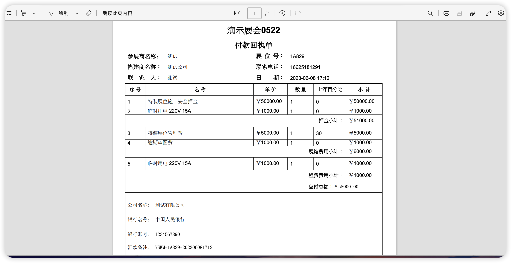
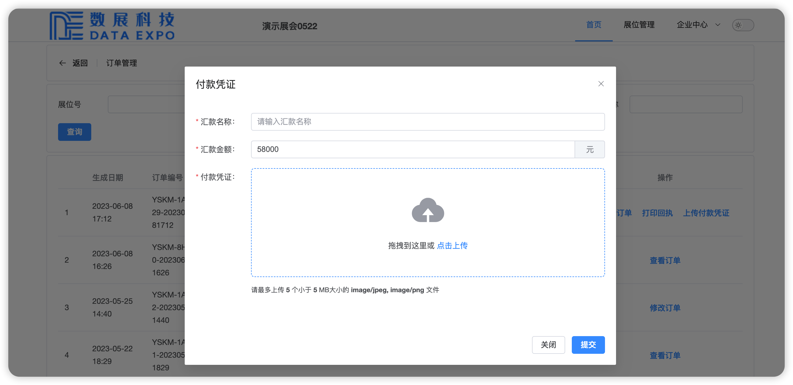

## 功能简介

根据国家大额支付相关法律条文及管理规定，目前系统仅支持线下对公转账。

用户在操作完成转账后，需要保存银行的付款回执单，再将其上传到系统，主场管理方财务人员在确认到账后，才可进行下一步操作。

## 操作流程

用户在上传付款凭证前，需要先点击`打印回执`按钮下载付款通知书，以获得主场管理方的银行收款信息。

付款通知书见下图：

获取到收款银行信息之后，通过网银或柜台等方式向主场管理方汇款，完成汇款之后，保存您的银行汇款业务回单。汇款金额务必要与订单金额一致，否则将影响您之后的操作。

汇款完成之后，点击`上传付款凭证`按钮。

在汇款名称处，输入您的公司名称，汇款金额如果您是全额汇款就不用编辑，系统将默认读取该订单的金额。然后在将您保存的业务回单上传。完成之后点击提交即可。

