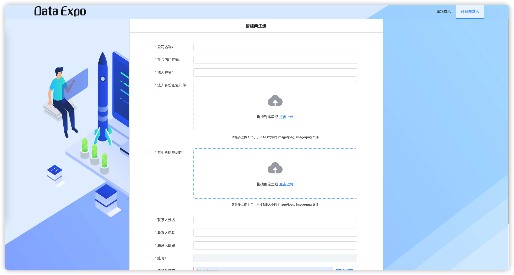

## 准备材料

在注册账号之前，您需要提前准备好以下材料以便于接下来注册时填写资料：

- 企业的工商营业执照；
- 企业法人的身份证复印件或照片；
- 能正常接收短信的手机；
- 能正常接收邮件的邮箱；

::: warning 注意

为了您能正常完成账号注册，请一定事先准备这些材料。

:::

## 开始注册

::: warning 前提条件

需要提前准备好材料，否则将会影响您的进度。

:::

本文将帮助您从零开始获得一个基本的搭建商账号。如果您已拥有该系统的搭建商账号请从 [特装申报指南](/guide/builds/builder.md) 开始。

1. 点击下方链接进入主场服务平台或将其复制到浏览器打开。

   https://builds.dataexpo.com.cn/login/build

2. 进入系统登录页后，点击登录按钮下方的`注册账号` 按钮 。

   

3. 进入注册页后，按要求/上传要求的信息。

   

4. 点击`立即注册` 按钮。

至此您已完成搭建商账号注册，请进行下一步：登录系统。

