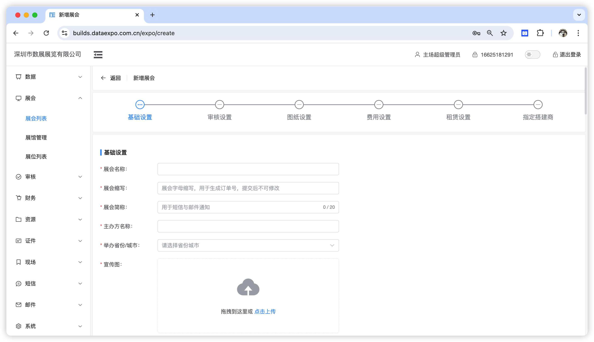
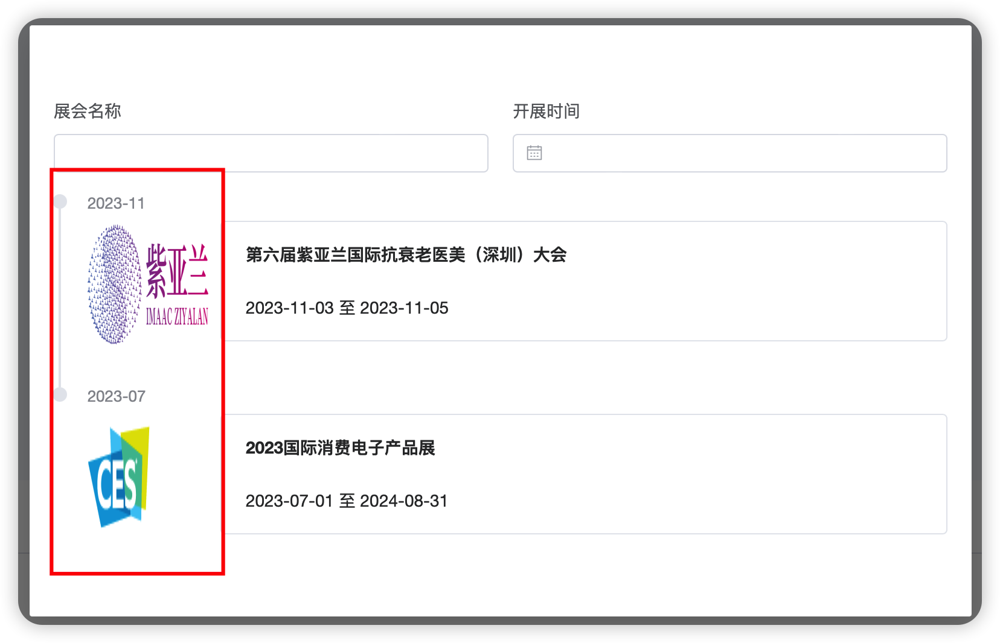
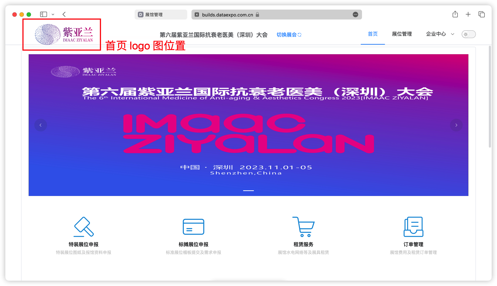
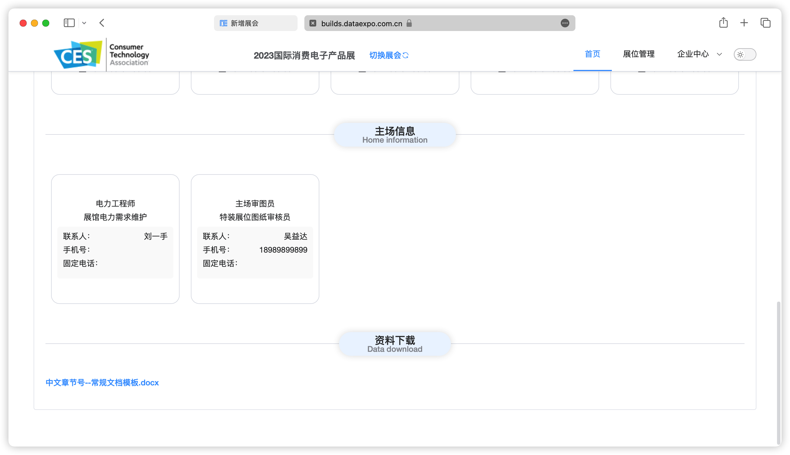
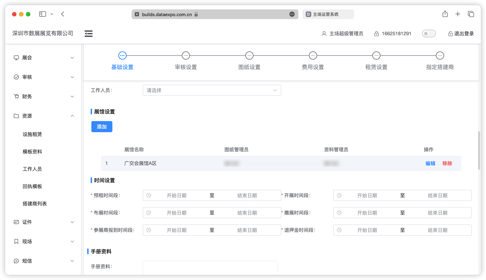
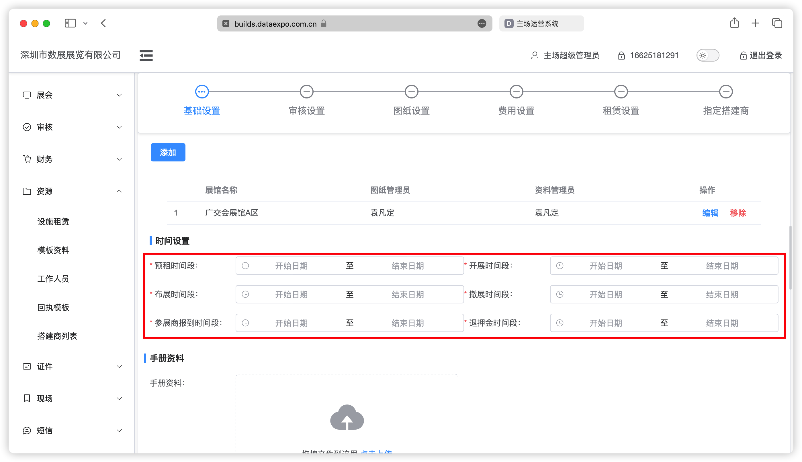
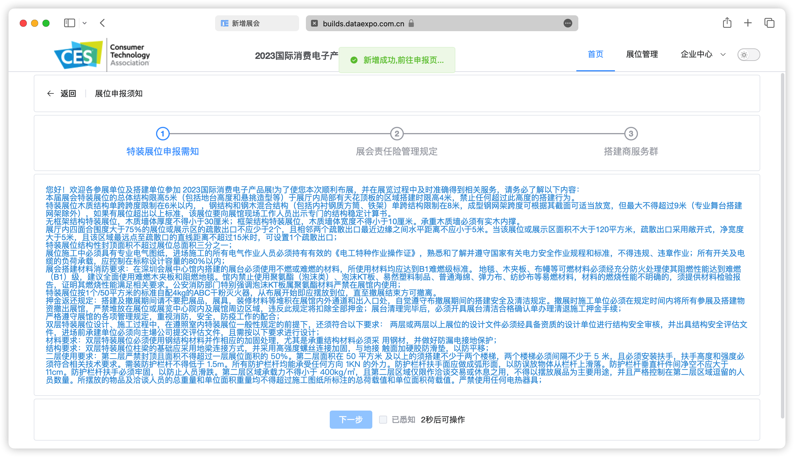

## 基础信息

1. 展会缩写：仅支持输入英文，用于生成订单号；
2. 展会简称：展会名称可能会很长，而短信根据字数限制计费；
3. 公司名称：填写当前收款账户的银行开户名称；
4. 银行名称：填写该银行账户的开户行。

“logo 图”与“首页 logo 图”的区别：

logo 显示在搭建商端的项目选择列表左侧；

首页 logo 图显示在搭建商端选择项目后的首页左上方。

## 工作人员

通过该项配置搭建商首页的【主场信息】，数据来源于`资源>工作人员`模块。

## 展馆设置

1. 图纸管理员：设置后，该人员只能查看当前项目的当前展馆下的图纸；

2. 资料管理员：设置后，该人员只能查看当前项目的当前展馆下的资料。

::: warning 注意

***设置为图纸/资料管理员后，系统会自动为该人员赋予当前项目的数据权限。***

:::

## 时间设置

1. 预租时间段：根据此时间段判断审图费用、展具设施、押金是否上浮
2. 退押金时间段：根据此时间段控制搭建商端【退押金】按钮的显示与隐藏
3. 其它时间暂时只做系统展示作用

## 手册资料

上传如展商手册、展位设计图模板供搭建商下载。

## 报馆设置

设置后将显示到搭建商特装申报流程中，如下：

