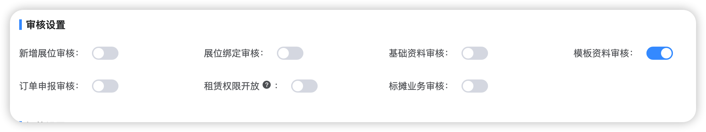
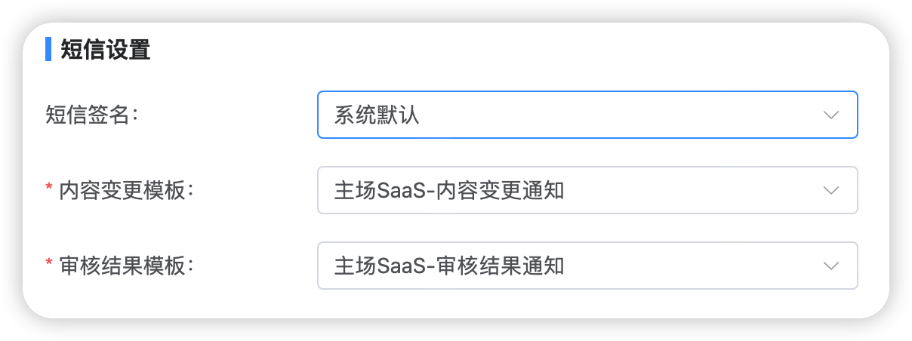

## 菜单设置

主要用作控制搭建商端首页菜单入口，当功能被勾选时，该项目首页才会显示该功能入口。

如图所示，当您在此处仅勾选特装申报、标摊申报、租赁服务、订单管理时，项目首页将仅显示这些入口：

## 审核设置

针对系统内各节点是否开启人工审核的设置，管理员可根据项目需求决定开启或关闭。

1. 新增展位审核：当主场无法提前获取项目展位清单时，允许搭建商自主新增展位，开启后需人工审核通过，否则系统自动审核通过；
2. 展位绑定审核：主场已提前导入展位的情况下，搭建商输入展位号进行绑定，此时该开关如果开启则需要人工审核，否则系统自动审核通过；
3. 基础资料审核：对应主场端-搭建信息审核页的节点，搭建商提交搭建信息后，此时如果该开关开启则需要人工审核，否则系统自动审核通过，建议开启；
4. 模板资料审核：对应主场端-图纸/资料审核，默认开启人工审核，不建议关闭人工审核；
5. 订单申报审核：搭建商提交订单（对应搭建商的租赁结算操作），此时如果该开关开启则需要主场人工审核通过，搭建商才可对订单进行付款；
6. 租赁权限开放：针对特装展位，当开关开启时，展馆费用订单会在搭建信息审核通过后生成；当开关关闭时，展馆费用订单会在图纸资料全部审核通过后生成；
7. 标摊业务审核：审核标摊的楣板信息或收集参展商的其它需求。

## 短信设置

选择使用何种签名及模板，在未申请签名的情况下，仅支持默认模板。

1. 短信签名

