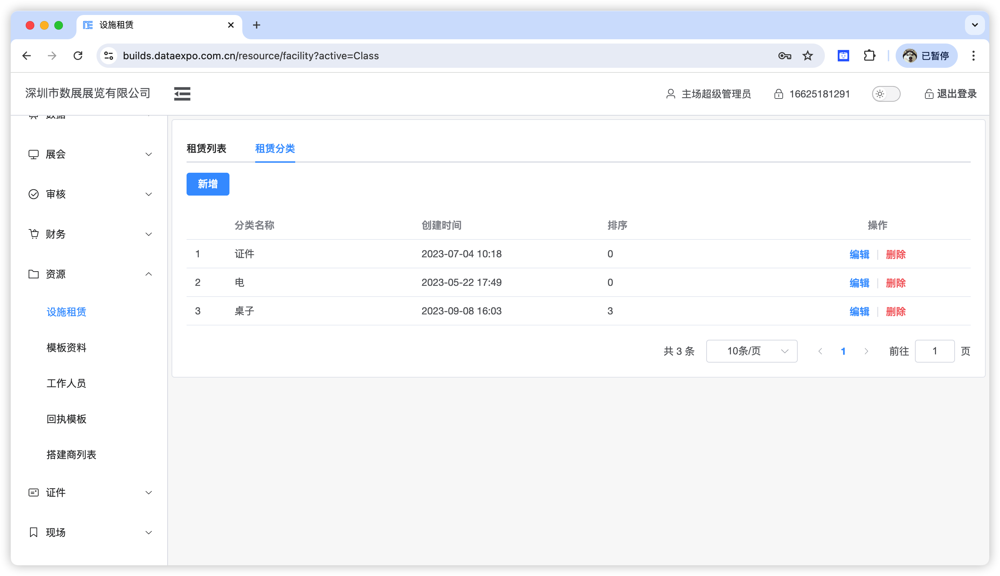
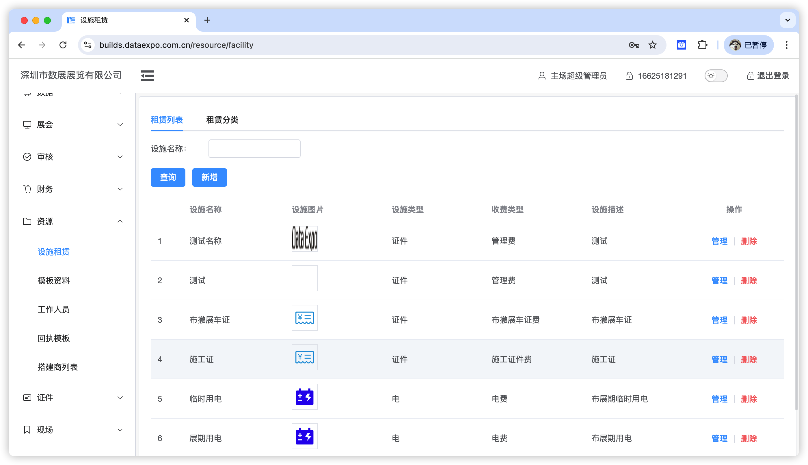
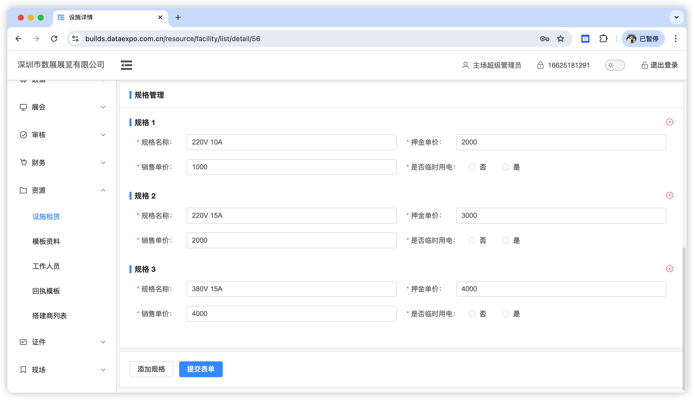

设施租赁模块提供对展具、水、电、气、网等设施的分类管理能力。

## 设施分类

自定义展具分类，可任意添加分类。注意：已有展具数据的分类无法删除。

## 设施列表

设施列表提供新增、编辑、删除功能。

### 新增

设施类型：即选择自定义的设施分类
收费类型：用于生成数据报表，如果无对应的类型，选择其它即可；当收费类型选择电费时，在设置规格时需要选择是否为临时用电，按需设置即可。
规格：型号相同的电脑提供不同配置可选，实际应用如下图。

移除规格：点击规格右上方的 ⊝ 图标即可。

