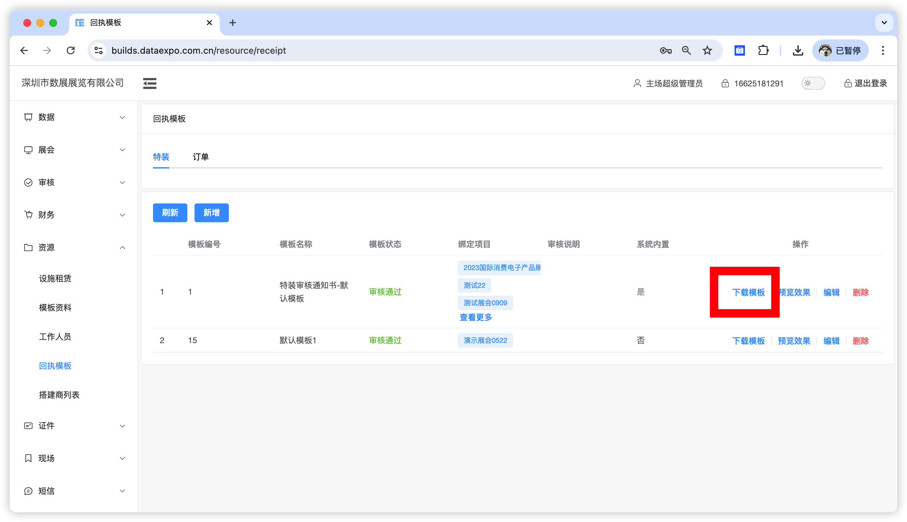
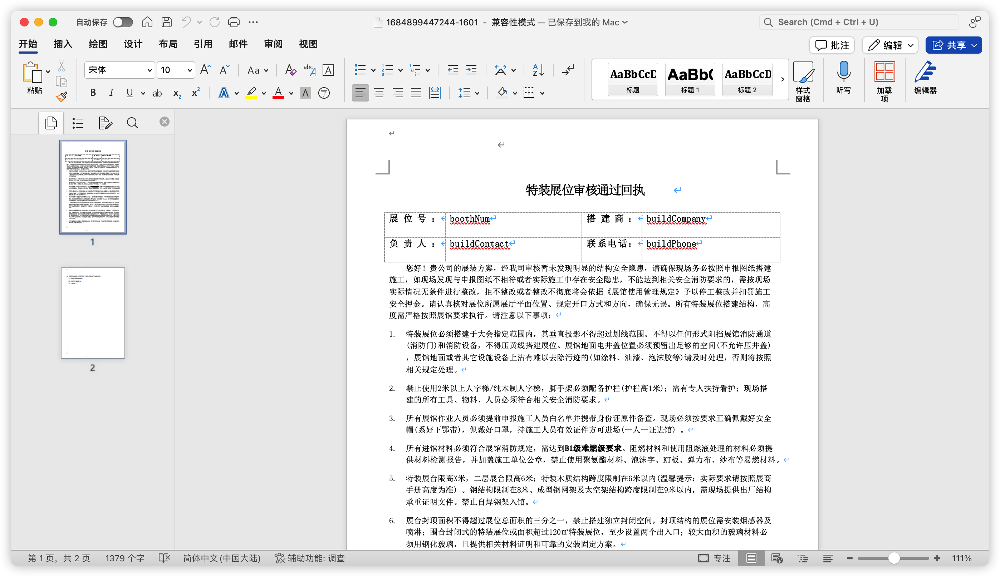
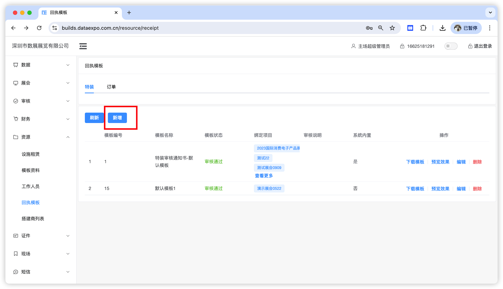
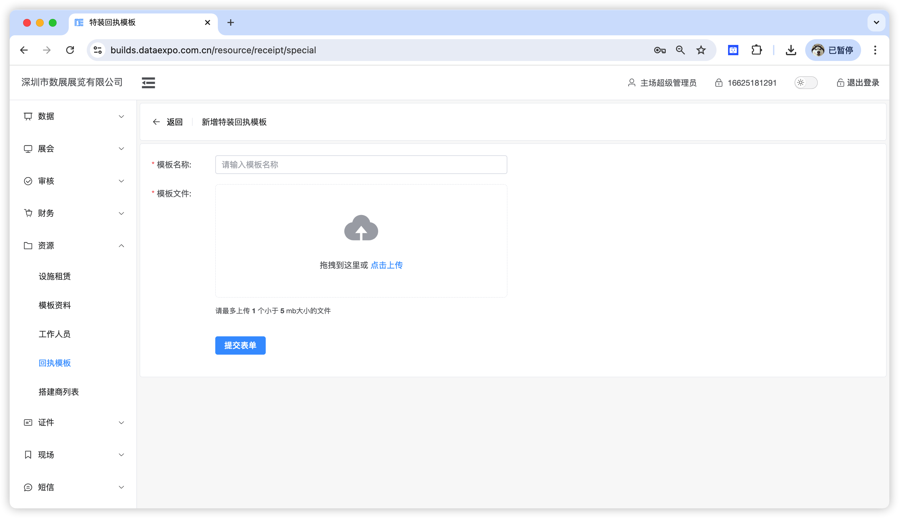
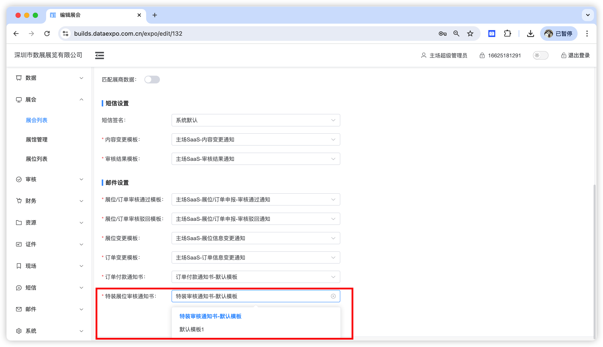

系统提供两个阶段的审核通过回执，分别是特装审核通过回执及订单审核通过回执（订单付款通知书），用户可自定义。

## 特装审核通过回执

图纸资料审核通过后系统会根据该模板生成回执文件，随通知邮件发送给搭建商，搭建商也可以在系统中自主下载。

这里主要说明如何自定义模板，推荐的方式是基于系统默认模板进行改造。

1. 下载默认模板

2. 基于默认模板进行改造，此处最多提供四个变量

| 展位号： | boothNum     | 搭建商：   | buildCompany |
| -------- | ------------ | ---------- | ------------ |
| 负责人： | buildContact | 联系电话： | buildPhone   |

页眉、页脚、主体内容、标题、表格内容皆可修改，需要注意的是，当需要使用变量时变量名称必须要与默认模板保持一致。

> 您好，您的展位：1H01 现已审核通过......

如上我们要实现展位号随不同展位变化，则修改为如下：

> 您好，您的展位：boothNum 现已审核通过......

3. 将编辑好的模板上传至系统，点击新增

4. 输入模板名称并上传模板后，点击`提交表单` 即可

5. 要实现最终的效果还需要将模板绑定到对应展会

## 订单审核通过回执

图纸资料审核通过后系统会根据该模板生成回执文件，随通知邮件发送给搭建商，搭建商也可以在系统中自主下载。
