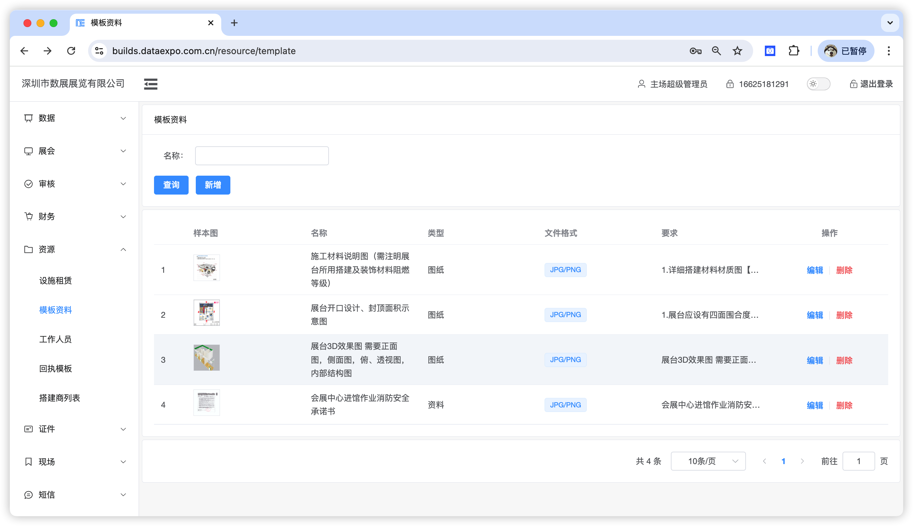

管理图纸资料的模板，当存在多个项目时用户可以快速调用此模块的数据。

> 图纸即常见展台搭建设计图、效果图、电路图等，通常情况下主场方需要提供示例图以供搭建商参考，搭建商则根据主场要求进行上传；资料即各类证明文件如电工证、材料证明文件、安全承诺书等。在实际业务过程中，这两类资料通常由不同人员进行审核，为方便管理故进行类型上的区分。

1. 模板资料类型：图纸 or 资料，即改模板要求搭建商上传的展位设计图还是搭建商资质文件；
2. 最大上传数量：即搭建商最多可上传多少份文件。